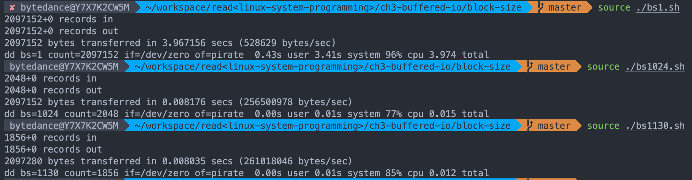
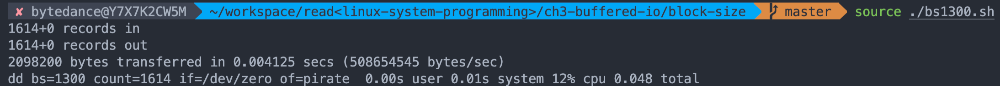

Performance degradation is exacerbated by the increased number of system calls required to read, say, a single byte 1,024 times rather than 1,024 bytes all at once. Even a series of operations performed in a size larger than a block can be suboptimal if the size is not an integer multiple of the block size. For example, if the block size is one kilobyte, operations in chunks of 1,130 bytes may still be slower than 1,024 byte operations.    
读写相同大小的字符数，每一次操纵的块大小更大，最终的速度不一定更快。比如上面，设备的块大小是1kb，以1130字节为单位操纵数据可能比以1024字节操纵数据更慢。虽然前者可以减少系统调用次数，但是可能因为block size未对齐而花更多时间。     
我在自己电脑上对比了，结论和书上的不太一致。[对比代码](./block-size/)
可能是因为硬件block size的影响吧。使用下面指令查了下/dev/zero块大小（不知道用法对不对）：
```bash
stat -f %k /dev/zero
```    
结果是`65536`，这么大的吗？     
又增加了下blocksize=1300，有效果了，慢了很多。
